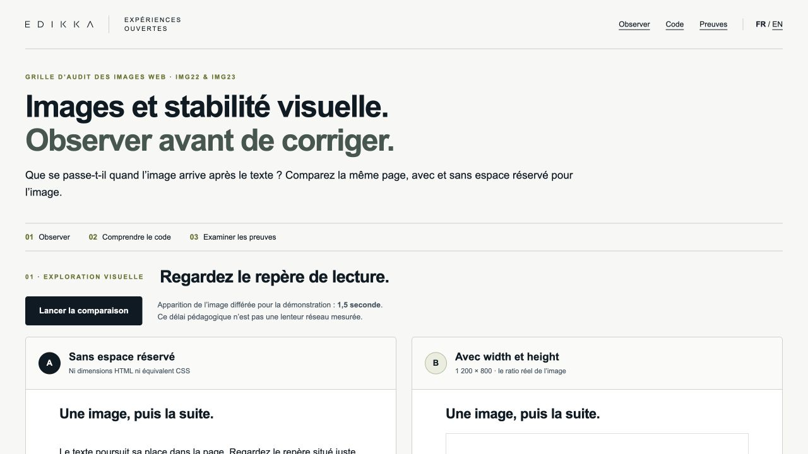

# Images et stabilité visuelle : observer avant de corriger

Démonstration Edikka **1.0.0**, complément de la **Grille d’audit des images web 1.1**, contrôles **IMG22 / IMG23**. Même JPEG et même scène, sans dimensions dans A, avec `width="1200" height="800"` dans B.

- [Démonstration FR](https://edikkaweb.github.io/image-layout-stability-demo/) · [English](https://edikkaweb.github.io/image-layout-stability-demo/index-en.html)
- [Instrument dans la bibliothèque](https://www.edikka.com/bibliotheque#instrument-web-image-audit-grid) · [Article source](https://www.edikka.com/insights/developpement-web/optimisation-images-web)
- [Protocole écrit avant mesure](docs/PROTOCOL.md) · [Reproduire](docs/REPRODUCTION.md) · [Vérifications et limites](docs/TESTING.md)



## Deux usages distincts

**Explorer** : le bouton lance deux scènes embarquées de mêmes dimensions. Le `src` de l’image est attribué après **1,5 seconde**, délai pédagogique explicite, même en cache. Le déplacement mesuré est celui du repère, en pixels CSS ; aucun CLS d’iframe n’est attribué à la page parente. Les frames sont recréées à chaque rejeu. Aucun mouvement automatique ni animation en boucle ; une explication statique reste accessible.

**Mesurer** : `experiments/a.html` et `b.html` sont des documents principaux, avec image et `src` présents dans le HTML initial. Un serveur local retarde la réponse de **2 secondes**. Chaque essai utilise une nouvelle navigation et un contexte propre. `web-vitals 6.2.2` rapporte le CLS dans la fenêtre **0–6 secondes**. Pas de CLS final de visite ni de données terrain.

## Observations datées

Première série : **2026-10-01T08-01-22-336Z**. Chrome **154.0.8037.59**, Playwright **1.63.0**, Node **22.12.0**, deux viewports émulés sur ordinateur (390 × 844 et 1440 × 900, DPR 1), trois répétitions par variante. Les douze essais sont valides selon le protocole ; tous les relevés et leurs captures sont dans `results/`.

Le tableau public est **généré directement depuis les JSON**, sans ressaisie des chiffres. Les versions, valeurs non arrondies, horaires, positions, événements `layout-shift`, `hadRecentInput`, rectangles des éléments déplacés, visibilité, cache, erreurs et ressources sont conservés dans chaque relevé. Les chiffres historiques de l’article Edikka ne servent pas de résultats à cette démo.

Les résultats ne décrivent que cette scène, ce navigateur et ces conditions. Une absence de décalage dans B n’est pas une garantie pour tout site. Aucun gain SEO, conversion ou conformité n’est annoncé. Les éléments déplacés ne sont pas automatiquement la cause. API absente ou rapport manquant = indisponible (`null`), jamais zéro inventé.

## Démarrer

Node **22+**, npm et Google Chrome installé (ou Chromium Playwright, voir reproduction).

```sh
npm ci
npm run build
npm start
# http://127.0.0.1:4181/image-layout-stability-demo/
```

Les mesures sont une opération volontaire séparée : `npm run measure`. Le build et GitHub Actions ne lancent aucune mesure. `npm run results` reconstruit le HTML depuis les archives.

## Organisation et traçabilité

- `experiments/` : deux documents, CSS commun, observateur et protocole figé.
- `assets/` : image inchangée, provenance, autorisation applicable, dimensions et SHA-256.
- `vendor/` : module web-vitals 6.2.2 et sources de référence / licence Apache-2.0, vérifiés contre le paquet npm.
- `scripts/` : serveur, collecte, construction, vérification.
- `presentation/` : styles et interactions de la consultation publique.
- `results/` : relevés et captures immuables, manifeste de série et ZIP des fichiers influents.
- `tests/`, `docs/` : contrôles et reproduction.
- `dist/` : publication générée, ignorée par Git.

La révision expérimentale SHA-256 exclut le rendu des résultats et leur build ; elle ne dépend pas de ses propres sorties. Les séries anciennes restent consultables et inchangées. Les futurs essais créent une nouvelle série datée. Le site restitue la dernière série, avec accès aux archives antérieures.

## Droits

Code original : [MIT](LICENSE). **L’image Edikka est exclue de MIT** : sa réutilisation dans cette démonstration Edikka est autorisée par la commande du 1er octobre 2026 ; aucune licence ouverte supplémentaire sur l’image n’est présumée. Sa provenance exacte figure dans [assets/provenance.json](assets/provenance.json). Les définitions IMG22/IMG23 proviennent de la grille Edikka 1.1 sous CC BY 4.0. web-vitals conserve sa licence Apache-2.0. Aucun fichier privé du site Edikka n’est inclus.

---

# English

**Images and visual stability: observe before fixing** — demo 1.0.0, companion to the [Edikka web-image grid 1.1](https://www.edikka.com/en/library#instrument-web-image-audit-grid), [source article](https://www.edikka.com/en/insights/web-development/web-image-optimisation), controls IMG22 and IMG23.

Two otherwise identical experimental documents load the **same JPEG bytes**. B adds intrinsic `width="1200" height="800"`; A has neither HTML dimensions nor equivalent CSS space reservation. The resource filename contains 600, but the actual JPEG dimensions are 1200 × 800 and are verified from its bytes.

The public exploration waits 1.5 seconds before assigning the image source. This teaching delay is not network latency, and marker movement is not CLS. The separate laboratory protocol delays the image response by 2 seconds on a local server and observes fresh top-level navigations for 0–6 seconds with web-vitals 6.2.2. It preserves session windows and excludes recent input. Replaying the exploration does not reset the parent page CLS.

Twelve actual archived trials from 1 October 2026 cover two desktop-emulated viewports and three repetitions per variant. JSON files contain precise values, timestamps, browser/tool/OS versions, cache, visibility, positions and raw shift sources. HTML results are generated, not transcribed. No physical phone, field data or general SEO/conversion/accessibility benefit is claimed.

Install: `npm ci`; build: `npm run build`; presentation: `npm start`; separate laboratory: `npm run lab`; new measurements: `npm run measure`; regenerate results: `npm run results`; pre-publication checks: `npm run prepare:publish`. See the [bilingual reproduction guide](docs/REPRODUCTION.md). New data is stored in a distinct dated series without overwriting prior observations. Experimental revisions exclude generated presentation/results, avoiding circular hashes.

Original code is MIT; the Edikka image is separately authorised for this demonstration and excluded from MIT. web-vitals is Apache-2.0; quoted grid control definitions are CC BY 4.0. Rights and hashes are recorded in `assets/provenance.json`.

[Contribuer / Contributing](CONTRIBUTING.md) · [Toutes les démonstrations / All experiments](https://edikkaweb.github.io/)

La détection automatique de GitHub peut afficher « Other » : le fichier LICENSE conserve les exclusions des archives, composants tiers et marques. Le code original reste sous MIT dans le périmètre indiqué. / GitHub may show “Other”; the existing licence scopes and exclusions remain authoritative.
